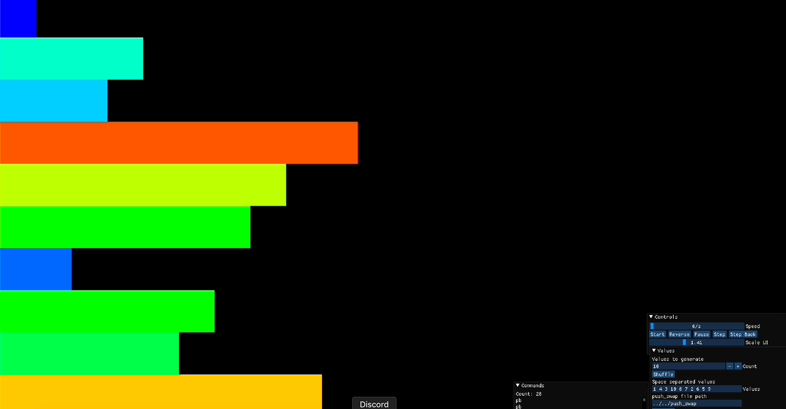

# push_swap
(como ordenar una serie de numeros usando dos pilas y una serie de instrucciones).

## Reglas

Tienes dos pilas: **pila a** y **pila b**. El objetivo es ordenar los números en **pila a** en orden ascendente utilizando la menor cantidad de operaciones posible.

### Configuración Inicial:
- **pila a** contiene una secuencia aleatoria de números únicos, positivos y/o negativos.
- **pila b** está vacía.

### Operaciones Disponibles:
- **sa (swap a)**: Intercambia los dos primeros elementos de **pila a**. No tiene efecto si solo hay un elemento o ninguno.
- **sb (swap b)**: Intercambia los dos primeros elementos de **pila b**. No tiene efecto si solo hay un elemento o ninguno.
- **ss**: Realiza **sa** y **sb** simultáneamente.
- **pa (push a)**: Mueve el primer elemento de **pila b** a **pila a**. No tiene efecto si **pila b** está vacía.
- **pb (push b)**: Mueve el primer elemento de **pila a** a **pila b**. No tiene efecto si **pila a** está vacía.
- **ra (rotate a)**: Desplaza todos los elementos de **pila a** hacia arriba por una posición. El primer elemento pasa a ser el último.
- **rb (rotate b)**: Desplaza todos los elementos de **pila b** hacia arriba por una posición. El primer elemento pasa a ser el último.
- **rr**: Realiza **ra** y **rb** simultáneamente.
- **rra (reverse rotate a)**: Desplaza todos los elementos de **pila a** hacia abajo por una posición. El último elemento pasa a ser el primero.
- **rrb (reverse rotate b)**: Desplaza todos los elementos de **pila b** hacia abajo por una posición. El último elemento pasa a ser el primero.
- **rrr**: Realiza **rra** y **rrb** simultáneamente.

## Ejemplo

Aquí hay un ejemplo de cómo funcionan las operaciones con una entrada de muestra.

### Configuración Inicial:

pila a: 2 1 3 6 5 8 pila b: _ _


### Después de Ejecutar las Operaciones:

**sa** (intercambiar a):

pila a: 1 2 3 6 5 8 pila b: _ _


**pb pb pb** (mover a b):

pila a: 6 5 8 pila b: 3 2 1


**ra rb** (rotar a y b):

pila a: 5 8 6 pila b: 2 1 3


**rra rrb** (rotar inverso a y b):

pila a: 6 5 8 pila b: 3 2 1


**sa** (intercambiar a):

pila a: 5 6 8 pila b: 3 2 1


**pa pa pa** (mover a a):

pila a: 1 2 3 5 6 8 pila b: _ _


Los números en **pila a** ahora están ordenados y se utilizaron 12 operaciones.

## Programa: push_swap

### Requisitos del Programa:


### Especificaciones del Programa:
- El programa debe ordenar **pila a** utilizando la menor cantidad de operaciones posible.
- Las instrucciones deben imprimirse línea por línea.
- Si no se dan argumentos, el programa no debe imprimir nada y debe devolver el prompt.
- Si ocurre un error (por ejemplo, entrada no válida, números duplicados), debe imprimirse `"Error"` en el error estándar.

### Manejo de Errores:
- Los argumentos no válidos (valores no enteros, duplicados o valores fuera de rango) deben hacer que el programa imprima `"Error"`.

### Uso de Ejemplo:
```bash
$> ./push_swap 2 1 3 6 5 8 
sa
pb
pb
pb
sa
pa
pa
pa
$> ./push_swap 0 one 2 3
Error
```

### Evaluacion:
Tu programa será evaluado usando un binario proporcionado para verificar el resultado de la pila ordenada. Si la salida no es correcta o el número de operaciones excede el límite, tu calificación será 0.

Comando de ejemplo:

Example command:
```bash
$> ARG="4 67 3 87 23"; ./push_swap $ARG | wc -l
6
$> ARG="4 67 3 87 23"; ./push_swap $ARG | ./checker_OS $ARG
OK
```

Si la salida es incorrecta, el programa checker_OS devolverá "KO".


